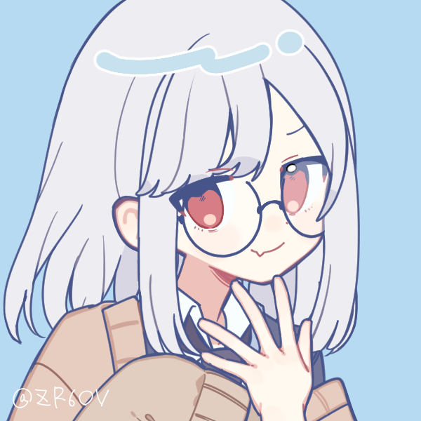

###  Hi I'm AsperaSerena

### About me  
  - 🏡I live in Seoul, South Korea

  - 👨‍🎓I'm Studenta and Beginner
  
  - ⤠My favorate language is 
  
  - 📚 I want to learn 

### Contact
  
  - 📮 my email... 

  - 🮠my... 

### My Stats

  

  

  

  
